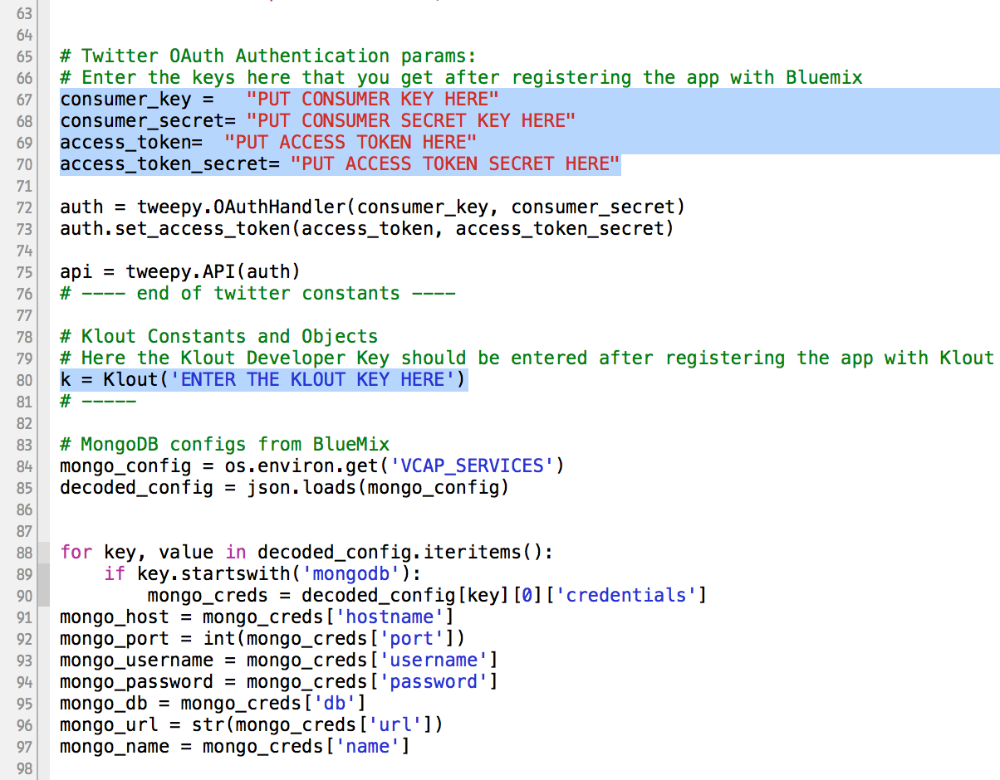
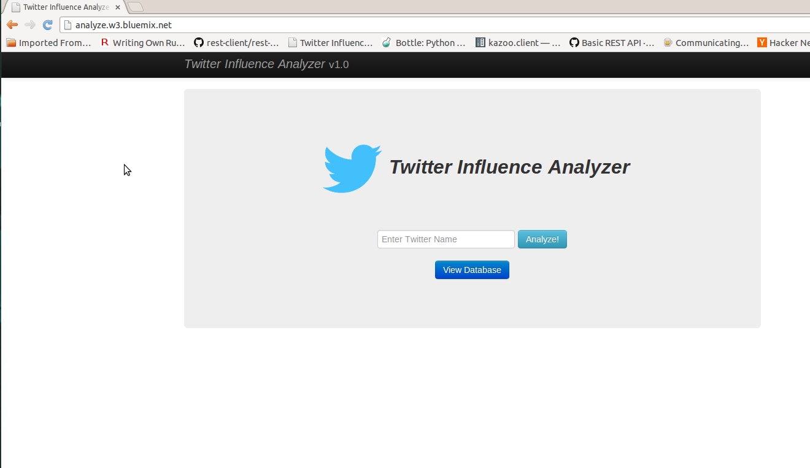
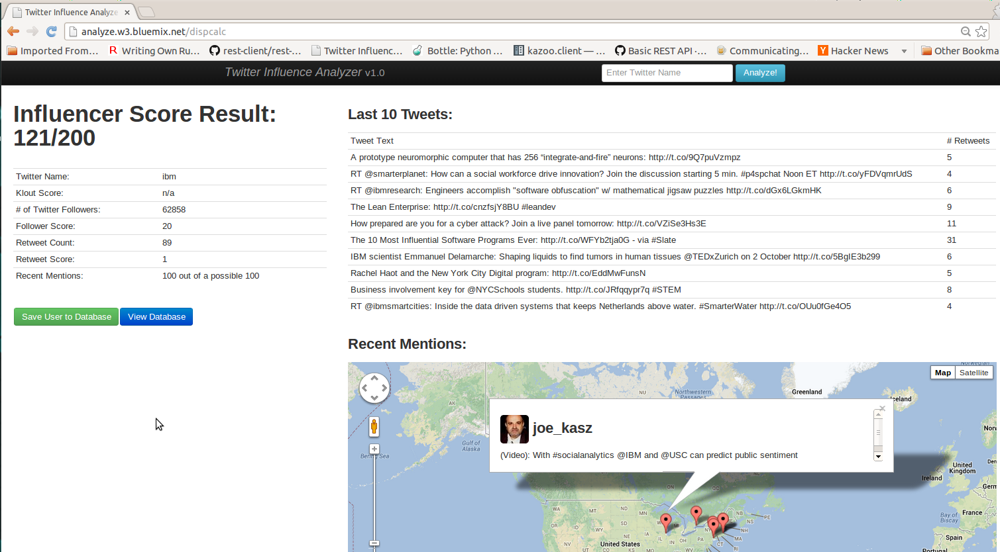

# How to Run and Deploy the Twitter Influence Analyzer #

## Overview of the app ##

This is a Python app that uses the [Bottle framework](http://bottlepy.org/docs/dev/) and the following services:

-   MongoDB (backend database)
-   SMTP (email notification service)
-   If this service is not available, the app will disable all features associated with sending email automatically. To enable the email notification features, just bind to the SMTP service to the app and then restart your app with the command **cf restart [appname]** or just **cf restart** if you are in the same directory as your app and its manifest.yml file. 

## Prerequisites ##

Before we begin, we first need to install the command line tool that will be used to upload and manage your application. Cloud Foundry uses a tool called [**cf**](https://github.com/cloudfoundry/cf). This tool is written in Ruby, so you must have Ruby installed. If you are running on Windows, you can install Ruby from [this](http://rubyinstaller.org/downloads/) website. 

For Linux systems, consult your documentation for how to install the **ruby** package - for Ubuntu the command:

	apt-get install ruby

should work for you.

Once Ruby is installed, cf can be installed by using the **gem install** command:
        
	gem install cf
		
## Download the App ##

The source for this app is at GitHub so, for example, if you are using the command line you can clone the repository like this:

	git clone https://github.com/ibmjstart/bluemix-python-sample-twitter-influence-app.git
		
## External and Public APIs ##

This app uses some external APIs. You need to register the app with Twitter and Klout to get the keys and tokens for the wsgi.py file.

### Twitter v1.1 API ###

To access the Twitter API you need the consumer keys and access tokens, so you must register the app with Twitter. You can register your app [here](https://dev.twitter.com/).

[More information on how to register the app with Twitter](registerTwitter.md)

### Klout API ###

You can register the app with Klout [here](http://developer.klout.com/member/). When you register with Klout, you'll get a Klout Key, which you can use to create a Klout Object as shown in the code.

### Google Maps v3 API ###

This app uses the Google Maps v3 APIs. Google APIs are open for the developers and you do not need to register the app with Google. Here's the [link](https://developers.google.com/maps/documentation/javascript/tutorial) for the Google Maps APIs.

Screen-shot of the wsgi.py file that shows where the Twitter keys and access tokens and Klout developer key is entered: 

## Deploying the App ##

After including the Twitter/Klout keys and tokens in the wsgi.py file (as shown above), you are ready to deploy the app. In the
terminal, go in the directory of the app (where wsgi.py is located). You can deploy/push the app using the push command:

	cf push --buildpack=https://github.com/ibmjstart/heroku-buildpack-python-05June2013.git --command="python ./wsgi.py"

Just follow the instructions on the screen. You can select the default settings for deploying the app, i.e. for URL, memory reservations (512 Recommended), number of instances. You need to bind the MongoDB service to the application.

### Binding a Service to Your App ###

Create the service instance and bind the service instance while deploying the app. The cf push command will ask, "Create services to bind to 'appname'?" Answer yes and go through the menu.

Note: This app expects details of the mongoDB service to be present in the environment variables (os.enivron.get('VCAP\_SERVICES')) and will fail if you try to deploy it without first binding the service.

Here are a few snapshots of how you would deploy the app and bind existing services to it.

After the application is deployed using 'cf push', you can check the status of the app using the following command: 'cf apps'. If the status is RUNNING, you can hit the URL in the browser and see the application is running.

#### requirements.txt ####

If your Python app requires any external dependencies (i.e. any modules that you install using 'pip install'), you need to include them in the requirements.txt file. Each module must be downloaded and put in the directory of the app (e.g. app), and the relative path to that module must be included in the requirements.txt file.

You should not need to do this to deploy this app because the dependencies are already included in the requirements.txt file, and the external modules are also included in the root directory of the app. While deploying the app, the requirements.txt file should be detected and automatically install the dependencies.

## Screenshots ##

This is the home screen of the app. You can enter a twitter screen name in the text box and click the Analyze button to see their influence. You can also view any records saved in the database by clicking on the 'View Database' button.
    

After entering the twitter name and clicking the Analyze button, you'll be able to see the influence analysis of that person on the left side. You will also see their last 10 tweets and any recent mentions in the tweets plotted on Google Maps (if there is geolocation data for a tweet).
    

These are the records of the Influencers in the database. The user can export the records as csv file. There is also a feature to send the records in csv format to any person via email using the SMTP service, if the SMTP service is not bound to the application you can not do this and the features will be disabled. 
    

